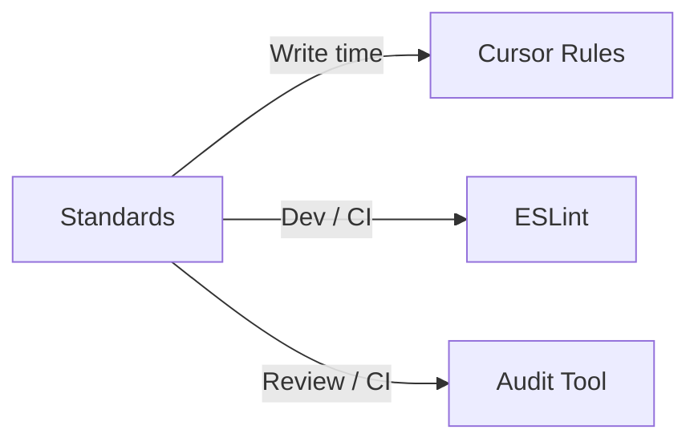

# Standards Overview

**🤖 Cursor Rule**: See [00-standards-overview.mdc](../cursor-rules/00-standards-overview.mdc) for AI-optimized directives that automatically enforce these standards.

## Purpose

This document provides an overview of the pace-core standards system, how it works, and how to use it. These standards are the **canonical development standards** for **pace-core** and **all consuming applications** in the pace-suite.

These standards are **human-readable first**, but are deliberately structured so they can be **enforced by automation**, including Cursor rules, ESLint, and custom audit tooling.

They are the **single source of truth**.  
All other quality tools must align *to these standards*, not reinterpret them.

---

## How to Use These Standards

### pace-core

- Treat these standards as **hard constraints**
- pace-core sets the bar and defines the contracts
- Any deviation must be explicitly documented here

### Consuming Applications

- Inherit these standards by default
- Only diverge where a documented exception exists
- Consuming apps should never weaken standards silently

### AI Agents (Cursor, Codex, etc.)

- Follow these standards **strictly**
- Do **not** silence rules to "make things pass"
- If compliance is unclear, stop and report rather than guessing

---

## The Four Layers of Quality Enforcement

The pace-suite uses **four complementary quality layers**, each with a distinct responsibility.  
They are intentionally overlapping in *coverage*, but **not duplicative in purpose**.

Think of this as *defence in depth*, not redundancy.

### 1. Standards Documents (Source of Truth)

**What they are**
- Human-readable `.md` documents
- Describe *intent*, *principles*, and *expectations*
- Technology-agnostic where possible

**What they are used for**
- Defining *what "good" looks like*
- Onboarding humans and AI agents
- Resolving ambiguity when tools disagree
- Designing new rules, lint checks, and audits

**What they are NOT**
- They are not executable
- They do not enforce anything by themselves
- They should not contain implementation hacks

➡️ **If there is a conflict, the standards win.**

### 2. Cursor Rules (Real-time Guidance)

Cursor rules live in the package under `cursor-rules/`. Consuming apps copy them into `.cursor/rules/` via `npm run setup` (see [pace-core Compliance](./5-pace-core-compliance-standards.md) for setup steps).

**What they are**
- AI-optimised interpretations of the standards
- Applied while code is being written or modified
- Prevent mistakes *before* they land

**What they are used for**
- Steering AI agents toward correct patterns
- Enforcing architectural intent during development
- Reducing rework later in linting or audits

**What they are NOT**
- They are not a replacement for lint or audits
- They should not invent new standards
- They should not silence problems "to move on"

➡️ Cursor rules **translate standards into behaviour**, but do not redefine them.

### 3. ESLint (Fast, Local Static Analysis)

**What it is**
- Deterministic, file-level static analysis
- Runs locally and in CI
- Focused on correctness, safety, and consistency

**What it is used for**
- Catching obvious issues early (types, hooks, imports, patterns)
- Enforcing mechanically checkable rules
- Preventing regressions during refactors

**What it is NOT**
- ESLint should not encode complex business rules
- It should not contain subjective or architectural debates
- It should not be silenced to "get green builds"

➡️ ESLint enforces *how code is written*, not *whether the system is correct*.

### 4. Audit Tool (Deep, System-Level Analysis)

**What it is**
- A custom static analysis tool
- Operates across files, folders, and systems
- Understands pace-core contracts and invariants
- Organized by the 10-file standards structure

**What it is used for**
- Validating architectural compliance (RBAC, data access, boundaries)
- Catching issues ESLint cannot see (cross-file analysis, configuration validation)
- Providing actionable remediation plans
- System-level checks (provider nesting, RLS policies in SQL, project structure)

**What it is NOT**
- It is not a linter replacement
- It should not report stylistic issues (handled by ESLint)
- It should not duplicate ESLint checks (file-level AST analysis)
- It should not contradict the standards

➡️ The audit tool answers: *"Is this system actually compliant?"*

**Usage:** In a consuming app (or from the repo root with pace-core available), run `npm run validate`. This runs type-check, lint, build, tests, and the pace-core audit. The pace-core audit report is written to `audit/<timestamp>-pace-core-audit.md`; ESLint output is written to `audit/<timestamp>-eslint-report.md` when the lint step runs.

---

## How the Layers Work Together

| Layer        | Strength                         | Timing          |
|--------------|----------------------------------|-----------------|
| Standards    | Intent & clarity                 | Design time     |
| Cursor rules | Preventive guidance              | Write time      |
| ESLint       | Fast mechanical enforcement      | Dev / CI        |
| Audit tool   | Deep architectural verification  | Review / CI     |

| Layer        | Out of scope |
|--------------|--------------|
| Standards    | Not executable; do not enforce by themselves |
| Cursor rules | Not a replacement for lint or audits |
| ESLint       | Not system-level correctness; not complex business rules |
| Audit tool   | Not stylistic issues; not file-level AST duplication |

No single layer is sufficient on its own.  
Together, they create a **repeatable, scalable quality system** for both humans and AI.

### Traceability

- **From audit report to standard:** Each audit section links to the corresponding standard doc (via the report; links are generated in the audit tool).
- **From ESLint rule to standard:** ESLint rules are grouped by standard (e.g. `01-pace-core-compliance`, `06-security-rbac`); rule names or plugin metadata map to the standard doc.
- **Principle:** When fixing a finding, open the referenced standard for intent and examples; fix the cause, do not silence the tool.

---

## Precedence Order

When standards conflict, apply this precedence order:

1. **Security** - Security and RBAC standards take highest priority
2. **API/RPC** - API contracts and RPC standards
3. **Components & Markup** - Component usage and markup quality
4. **Code Quality/Style** - TypeScript, naming, code style
5. **Testing & Documentation** - Testing and documentation requirements
6. **Consuming App Structure** - Project structure and organization

**Example:** If a component pattern conflicts with a security requirement, security wins.

### When tools disagree

- Treat the **standards document** as the arbiter. If the standard is clear, the tool that matches it is correct; fix the other or fix the code.
- If the standard is ambiguous, **update the standard first** (with rationale), then align the tool(s).
- Do not silence a tool to get a green build; fix the underlying issue or document an explicit, approved exception in the standard.
- **Remediation:** When the audit (or lint) fails in CI, use the generated report and the linked standard doc to fix issues, then re-run `npm run validate`.

---

## Standards File Mapping (SDLC order)

The standards are organized into 10 files in SDLC order (requirements/design → implementation → testing → operations). ESLint rule files are prefixed by standard number.

| File | Standard | SDLC stage | Cursor Rule | ESLint | Audit | Purpose |
|------|----------|------------|-------------|--------|-------|---------|
| `0-standards-overview.md` | Overview | Entry point | `00-standards-overview.mdc` | — | — | This file - entry point and system overview |
| `1-project-structure-standards.md` | Project Structure | Requirements/design | `01-project-structure.mdc` | — | Yes | Define standard folder structure |
| `2-architecture-standards.md` | Architecture | Requirements/design | `02-architecture.mdc` | — | Yes | Enforce SOLID architecture principles |
| `3-security-rbac-standards.md` | Security & RBAC | Requirements/design | `03-security-rbac.mdc` | Yes | Yes | Enforce RBAC contract and security |
| `4-api-tech-stack-standards.md` | API & Tech Stack | Requirements/design | `04-api-tech-stack.mdc` | Yes | Yes | Enforce tech stack versions and API standards |
| `5-pace-core-compliance-standards.md` | pace-core Compliance | Implementation | `05-pace-core-compliance.mdc` | Yes | Yes | Enforce pace-core usage patterns |
| `6-code-quality-standards.md` | Code Quality | Implementation | `06-code-quality.mdc` | Yes | Yes | Enforce code quality standards |
| `7-styling-standards.md` | Styling | Implementation | `07-styling.mdc` | Yes | Yes | Enforce clean markup and styling standards |
| `8-testing-documentation-standards.md` | Testing & Documentation | Testing | `08-testing-documentation.mdc` | Yes | Yes | Enforce testing and documentation standards |
| `9-operations-standards.md` | Operations | Operations/release | `09-operations.mdc` | — | Yes | Enforce error handling, performance, and CI/CD |

---

## Quick Reference Guide

**New to pace-core?** Start here:
1. Read [Standards Overview](./0-standards-overview.md) (this file) - Understand the system
2. Read [Styling Standards](./7-styling-standards.md) - **CRITICAL:** Required CSS setup
3. Read [pace-core Compliance](./5-pace-core-compliance-standards.md) - How to use pace-core
4. Read [Project Structure](./1-project-structure-standards.md) - Organize your code

**Common Tasks:**
- **Setting up a new app?** → [Project Structure](./1-project-structure-standards.md) + [Styling Standards](./7-styling-standards.md)
- **Writing components?** → [Architecture](./2-architecture-standards.md) + [Code Quality](./6-code-quality-standards.md)
- **Working with RBAC?** → [Security & RBAC](./3-security-rbac-standards.md)
- **Creating APIs/RPCs?** → [API & Tech Stack](./4-api-tech-stack-standards.md)
- **Handling errors?** → [Operations](./9-operations-standards.md)
- **Writing tests?** → [Testing & Documentation](./8-testing-documentation-standards.md)

---

## Requirements documents and feature work

When building from **requirements documents** (e.g. for a new or rebuilt codebase):

- **Requirements docs** should include: overview, acceptance criteria (testable outcomes), API/contract (no implementation detail), demo app requirements, and testing requirements. See the project brief and guardrails doc for the template.
- **Every feature** that can be exercised in the demo app must be **testable and demonstrable** there; requirements docs must specify which demo page(s) or flows verify the feature.
- **Security & RBAC (Standard 3)** applies to any feature that touches permissions, data access, or RLS; requirements docs for such features must reference the RBAC contract and Standard 3.

---

## Key Principles

- **Do not silence tools** — fix the underlying issue
- **Do not duplicate rules** — each layer has a purpose
- **Do not diverge silently** — document exceptions explicitly
- **Standards always win** — tools must align to them

---

## Related Documentation

- [Project Structure](./1-project-structure-standards.md) - Project structure and organization
- [Architecture](./2-architecture-standards.md) - SOLID architecture principles
- [Security & RBAC](./3-security-rbac-standards.md) - RBAC and RLS standards
- [API & Tech Stack](./4-api-tech-stack-standards.md) - Tech stack and API/RPC standards
- [pace-core Compliance](./5-pace-core-compliance-standards.md) - pace-core usage patterns
- [Code Quality](./6-code-quality-standards.md) - Code quality and TypeScript standards
- [Styling](./7-styling-standards.md) - Markup and styling standards
- [Testing & Documentation](./8-testing-documentation-standards.md) - Testing and documentation standards
- [Operations](./9-operations-standards.md) - Error handling, performance, and CI/CD

---

**Last Updated:** 2025-01-28  
**Version:** 2.0.0  
**Applies to:** All pace-core and consuming apps

The standards version (e.g. 2.0.0) is updated when the standards system, precedence, or four-layer model changes; it is independent of the pace-core package version.
